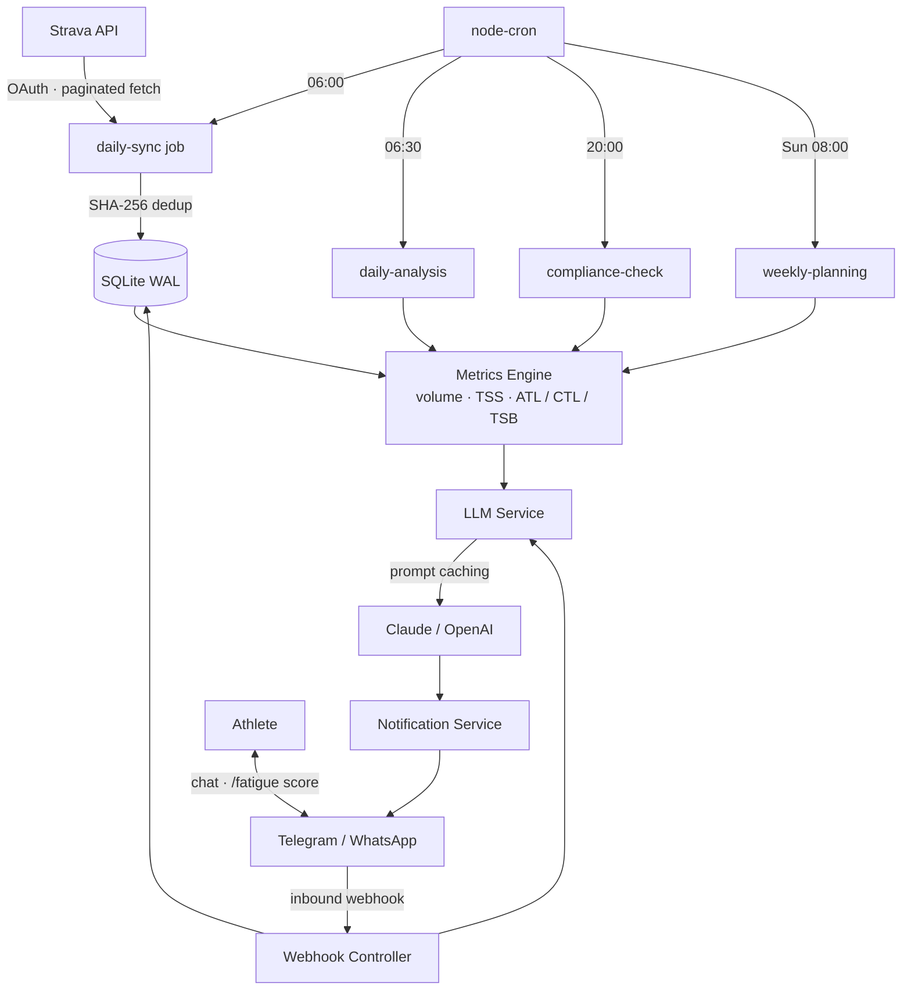

# TrainPilot

An AI-powered personal training coach that turns your Strava data into actionable coaching feedback. Syncs activities daily, computes training load metrics, and delivers personalized analysis via Telegram or WhatsApp — fully autonomous, self-hosted.

Built with **TypeScript · Node.js · Claude (Anthropic) · SQLite**.

---

## Architecture



---

## Features

- **Automated sync** — daily Strava pull with pagination, retry, and SHA-256 deduplication
- **Metrics engine** — pure-function calculators for TSS (HR + pace), ATL/CTL/TSB fatigue model, and session compliance
- **AI coaching** — daily briefings and weekly training plans via Claude, with prompt caching (~10× cheaper on repeated calls)
- **Real-time chat** — athletes ask questions and log subjective fatigue via Telegram or WhatsApp
- **Pluggable backends** — swap LLM (Claude / OpenAI) or notification channel via a single env variable
- **Idempotent jobs** — `INSERT OR IGNORE` semantics; re-running any job is always safe

---

## Tech Stack

| Layer | Technology |
|---|---|
| Runtime | Node.js 20 · TypeScript 5.5 (`strict: true`) |
| AI | Anthropic Claude SDK · OpenAI fallback |
| Database | SQLite (`better-sqlite3`) · WAL mode · `IStorage` abstraction |
| HTTP | Express 4 |
| Scheduling | `node-cron` |
| Notifications | Telegram Bot API · Meta WhatsApp Cloud API |
| Logging | Pino (structured JSON) |
| Validation | Zod |
| Testing | Vitest |
| Deploy | Docker (Alpine) |

---

## Quick Start

```bash
git clone https://github.com/manujc00005/TrainPilot.git
cd TrainPilot
npm install
cp .env.example .env   # add Strava, Anthropic, and Telegram credentials
npm run dev
```

Trigger a job manually:

```bash
curl -X POST http://localhost:3000/api/status/run/daily-analysis \
  -H "x-api-key: YOUR_API_KEY"
```

---

## Project Structure

```
src/
├── config/           # Zod-validated env vars — single source of truth
├── types/            # Pure TypeScript interfaces
├── services/
│   ├── strava/       # OAuth lifecycle, raw→internal mapping, paginated fetch
│   ├── metrics/      # Pure calculators: volume, TSS, fatigue, compliance
│   ├── llm/          # Claude & OpenAI providers + prompt templates
│   ├── notification/ # Telegram & WhatsApp delivery
│   └── storage/      # IStorage interface + SQLite implementation
├── jobs/             # Cron orchestrators — no inline business logic
├── controllers/      # Express HTTP handlers
└── utils/            # Pure helpers: retry, date, hash, logger
```

**Dependency rule**: `controllers / jobs → services → utils` — strictly enforced, no circular imports.

---

## License

MIT
